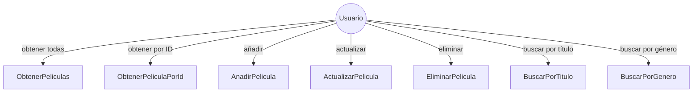
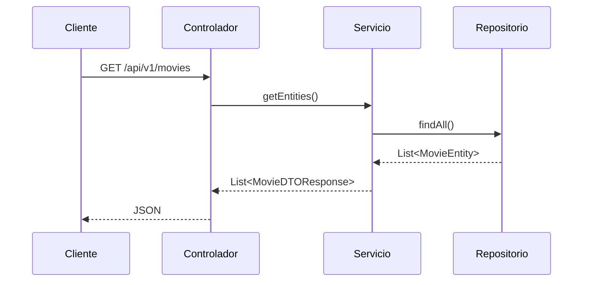
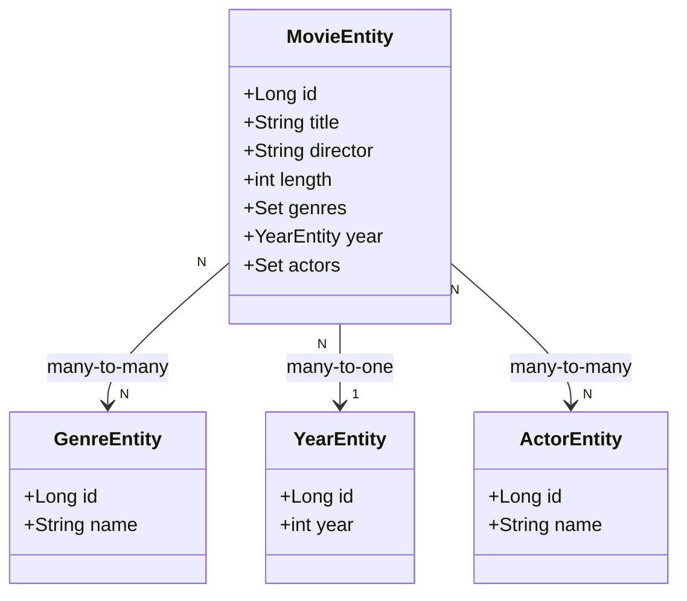
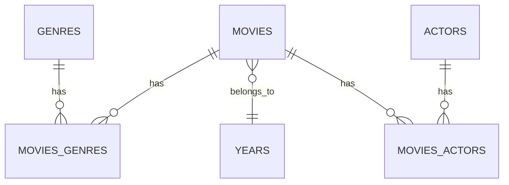

# API REST de Películas

API REST para gestionar películas, géneros, años y actores.

## Descripción

API REST desarrollada con Spring Boot que permite:
- Obtener todas las películas
- Obtener una película por ID
- Añadir una película
- Actualizar una película
- Eliminar una película
- Buscar películas por título o género

## Pre-requisitos

- Java 21
- Maven
- Spring Boot 4.1.1

## Instalación

```bash
git clone <repositorio>
cd api-rest-movies
mvn install
```

## Ejecución

```mvn spring-boot:run```

## Endpoints

Método	Endpoint	Descripción
GET	/api/v1/movies	Obtener todas las películas
GET	/api/v1/movies/{id}	Obtener película por ID
POST	/api/v1/movies	Añadir película
PUT	/api/v1/movies/{id}	Actualizar película
DELETE	/api/v1/movies/{id}	Eliminar película
GET	/api/v1/movies/search?title=Cure	Buscar por título
GET	/api/v1/movies/search?genre=Drama	Buscar por género

## Diagramas

### Diagrama de casos de uso


### Diagrama de secuencia (GET /api/v1/movies)


### Diagrama de clases


### Diagrama de Chen (Entidad-Relación)


### Diagrama de patas de gallo

